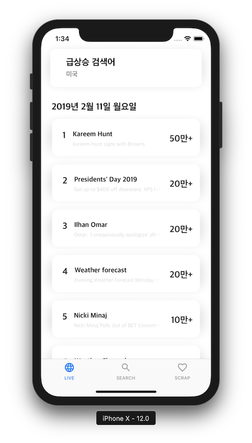
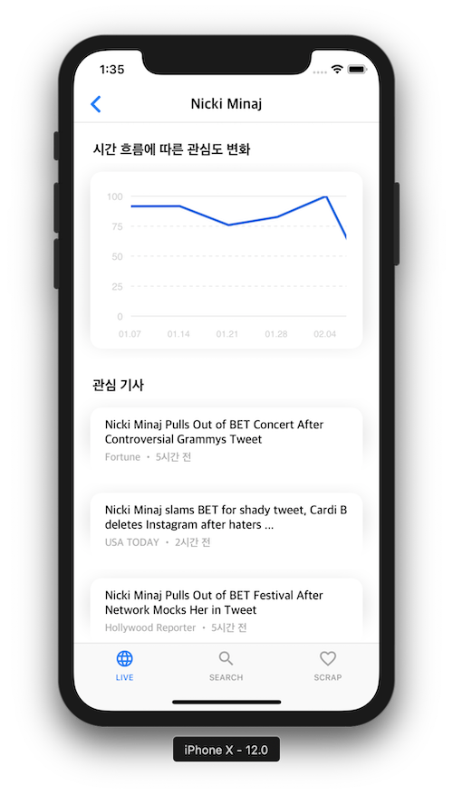
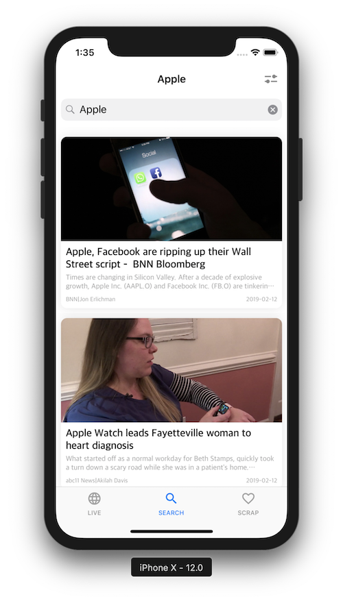
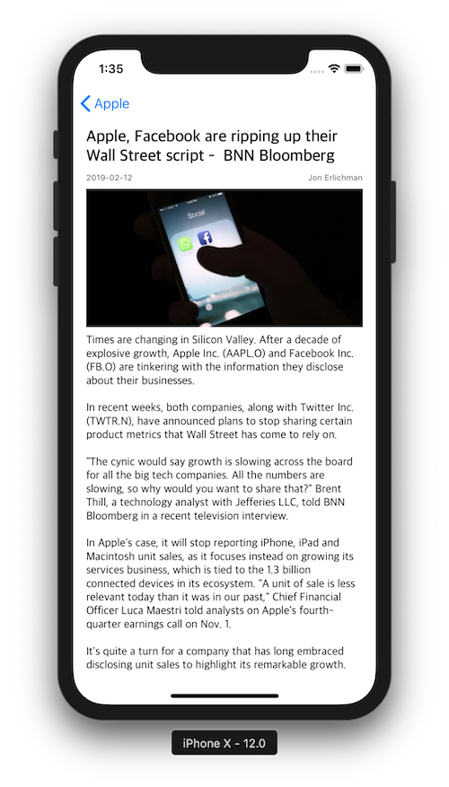

# TREE
> 전 세계 이슈(급상승 검색어, 뉴스 기사)를 실시간으로 제공하는 애플리케이션

## Team Gardener
> BoostCamp 3th A-1 Team

- [박성준](https://github.com/godpp) 
- [김혜리](https://github.com/kimhyeri) 
- [김현태](https://github.com/onemoongit)

## GROUND RULE

* 공통된 코드 컨벤션을 사용합니다.
- [Wiki](https://github.com/boostcamp3-iOS/team-a1/wiki/Swift-Style-Guide)에 정의하였습니다.
* 코드의 효율성을 증대시킵니다.
- 재사용 가능한 부분에 대해서는 모듈로 활용하여 사용합니다.
- PR에 대한 코멘트를 활용하여 서로의 코드를 적극적으로 리뷰합니다.
* 대화를 통한 적극적인 피드백을 주고받습니다.
- 매일 아침 10시부터 데일리 스크럼을 통해 어제 한 작업을 공유하고 오늘 해야할 작업을 명확하게 설정합니다.

## 기능 트리

## 현재까지 작업한 뷰

> LIVE

> SEARCH

