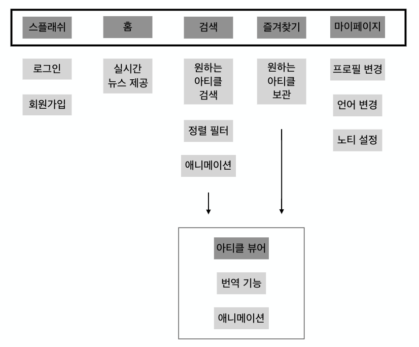

# TREE 🌳
> 전 세계적인 이슈를 확인할 수 있는 애플리케이션 

## ⚠️ GROUND RULE ⚠️

- 공통된 코드 컨벤션을 사용합니다.
- 코드의 효율성을 증대시킵니다.
- 대화를 통한 적극적인 피드백을 주고받습니다. 
- 프로젝트 완성을 목표로 합니다.

## 📑 앱 기획서 📑
  ### 기능 트리
-

## 🔜 핵심 기능 구현 순서 🔜

- 검색을 통해 유저가 원하는 다양한 아티클 검색 가능
- 가독성을 높이고 빠른 응답 속도를 보여주는 네이티브 뷰어 기능
- 전 세계에서 업데이트 되는 뉴스를 실시간으로 표시
- 아티클 스크랩을 할 수 있는 아카이빙 기능
- 파파고 API를 활용하여 다양한 언어로 번역 가능
